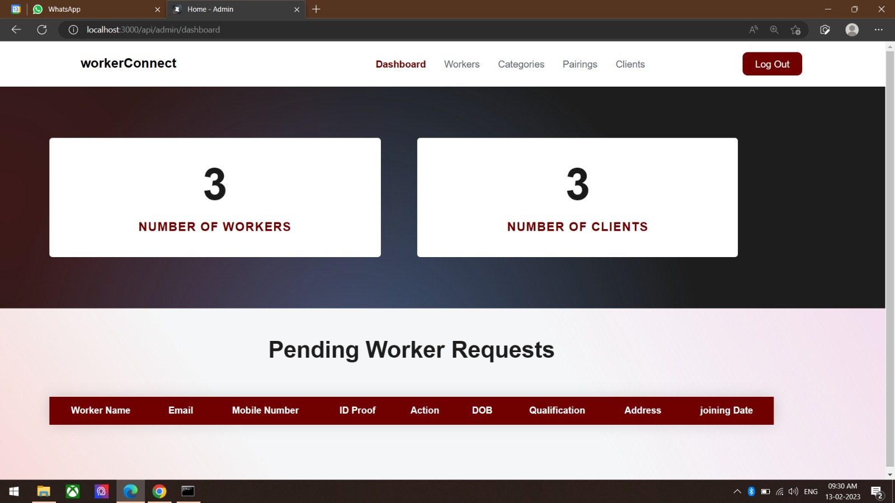
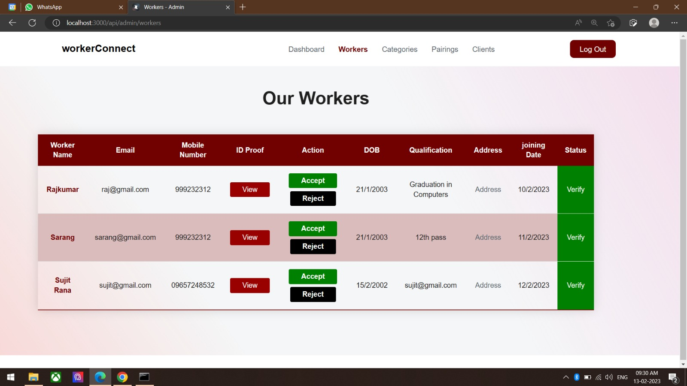
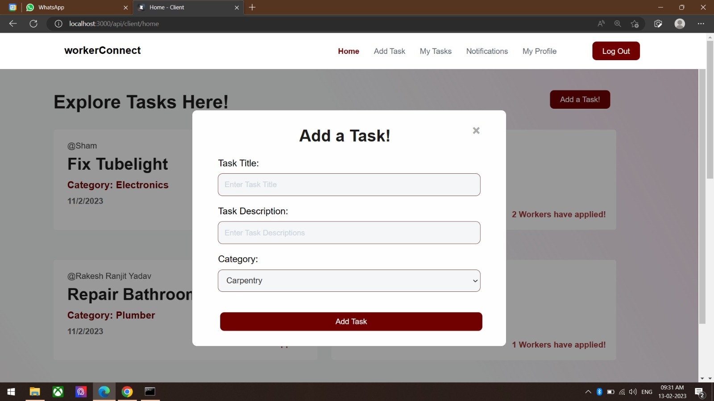
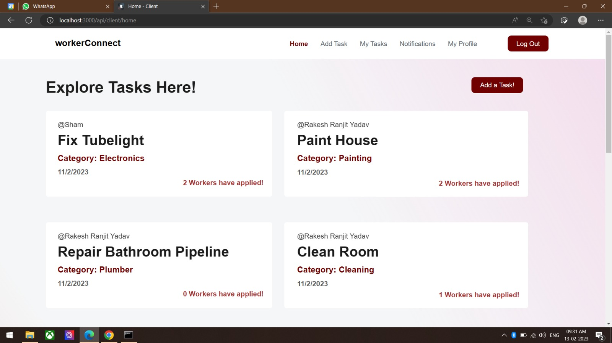
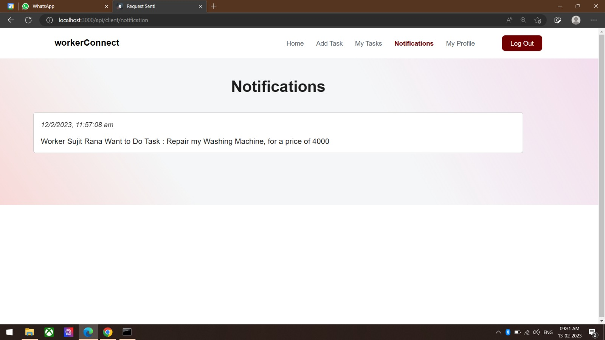

# Aapka Kaam

**Aapka Kaam** is a platform designed to bridge the gap between blue-collar workers and individuals in need of their services. The platform empowers blue-collar workers by giving them a space to showcase their skills, connect with potential clients, and negotiate fair prices for their services. 

### Features:
- **Worker Profiles**: Blue-collar workers can create detailed profiles, showcasing their skills and past work, helping clients assess their capabilities.
- **Job Posting & Application**: Clients can post job requirements, and workers can apply based on their skills, location, and availability.
- **AI-Powered Matching**: AI is used to match workers with relevant job opportunities, making the process smarter and more efficient.
- **Price Negotiation**: The platform includes a feature for clients and workers to negotiate and agree on fair pricing terms.
- **Authentication & Trust**: Workers are verified to ensure authenticity, creating a secure and trustworthy environment for both clients and workers.

### About the Project:
**Aapka Kaam** is focused on empowering the vast number of blue-collar workers in India, who play a critical role in the economy but often face difficulties in accessing reliable job opportunities. The platform aims to provide these workers with better visibility, a more transparent way to negotiate, and a chance to grow their professional network. 

In a country where millions are engaged in blue-collar work, **Aapka Kaam** leverages AI to streamline job matching, enhance skill validation, and optimize pricing, making the entire process simpler and more effective for both workers and clients.

### Vision:
To create an ecosystem that empowers blue-collar workers, connects them to meaningful job opportunities, and ensures fair transactions for both clients and service providers.

## 🚀 Demo
<div align="center">
    <h4 align="left">Admin Dashboard</h4>
    
    <br>
    <br>
    <h4 align="left">Worker Verification</h4>
    
    <br>
    <br>
    <h4 align="left">User Adding Task</h4>
    
    <br>
    <br>
    <h4 align="left">Listing all Tasks/Jobs for Workers</h4>
    
    <br>
    <br>
    <h4 align="left">Notifications</h4>
    

</div>


<p align="right">(<a href="#readme-top">back to top</a>)</p>


## ⚙️ Built With

The technologies and tools used are:

- [![HTML][html]][html-url]
- [![CSS][css]][css-url]
- [![JavaScript][js]][js-url]
- [![MongoDB][mongodb]][mongodb-url]
- [![ExpressJS][express]][express-url]
- [![NodeJS][node]][node-url]

<p align="right">(<a href="#readme-top">back to top</a>)</p>

<!-- GETTING STARTED -->

## 🧑‍💻 Getting Started

Follow the below steps to set up the project locally:

### Prerequisites

You need to setup you MongoDB Clusters priorly and then follow the steps.

### Installation

1. Clone the repository

   ```sh
   git clone https://github.com/siddhesh-desai/Worker-Connect.git
   ```

2. Install the dependencies:

   ```sh
   npm i
   ```

<p align="right">(<a href="#readme-top">back to top</a>)</p>

## 💡 Features

<br>

- Price Negotiation System
- Notification System
- Add Tasks
- Worker Profile with Ratings

<p align="right">(<a href="#readme-top">back to top</a>)</p>

<!-- ROADMAP -->

## 🛣️ Roadmap

- [x] Price Negotiation System
- [x] Notification System
- [x] Add Tasks
- [x] Worker Profile with Ratings

See the [open issues](https://github.com/siddhesh-desai/Worker-Connect/issues) for a full list of proposed features (and known issues).

<p align="right">(<a href="#readme-top">back to top</a>)</p>

<!-- CONTRIBUTING -->

## 👣 Contributing

Any contributions you make are **greatly appreciated**.

If you have a suggestion that would make this better, please fork the repo and create a pull request. You can also simply open an issue with the tag "enhancement".
Don't forget to give the project a star! Thanks again!

1. Fork the Project
2. Create your Feature Branch (`git checkout -b feature/AmazingFeature`)
3. Commit your Changes (`git commit -m 'Add some AmazingFeature'`)
4. Push to the Branch (`git push origin feature/AmazingFeature`)
5. Open a Pull Request

[html]: https://img.shields.io/badge/HTML-20232A?style=for-the-badge&logo=html5&logoColor=61DAFB
[html-url]: https://developer.mozilla.org/en-US/docs/Web/HTML
[css]: https://img.shields.io/badge/Css-000000?style=for-the-badge&logo=css3&logoColor=white
[css-url]: https://developer.mozilla.org/en-US/docs/Web/CSS
[js]: https://img.shields.io/badge/Javscript-0769AD?style=for-the-badge&logo=javascript&logoColor=white
[js-url]: https://developer.mozilla.org/en-US/docs/Web/javascript
[mongodb]: https://img.shields.io/badge/mongodb-20232A?style=for-the-badge&logo=mongodb&logoColor=61DAFB
[mongodb-url]: https://www.mongodb.com/docs/
[express]: https://img.shields.io/badge/expressjs-000000?style=for-the-badge&logo=express&logoColor=white
[express-url]: https://expressjs.com/
[node]: https://img.shields.io/badge/NodeJS-0769AD?style=for-the-badge&logo=node.js&logoColor=white
[node-url]: https://nodejs.org/en/docs
